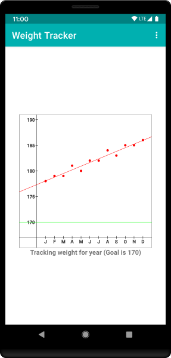
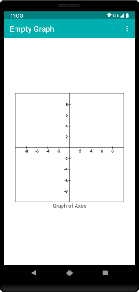
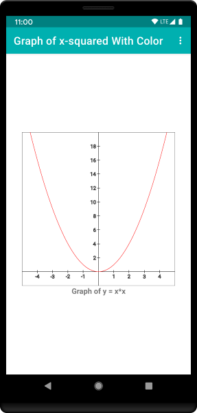
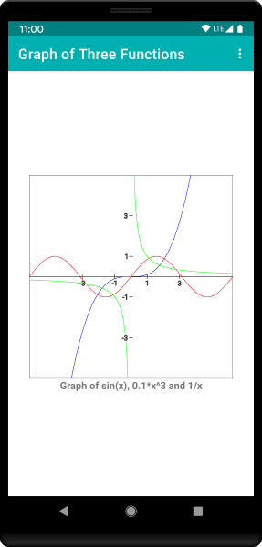
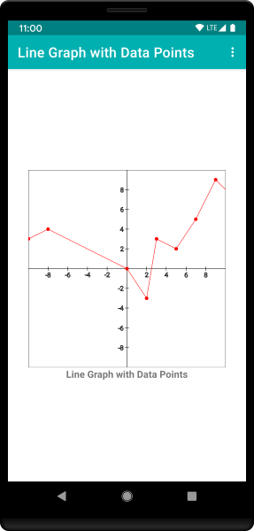
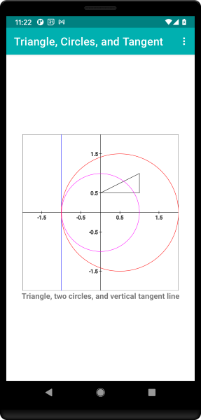
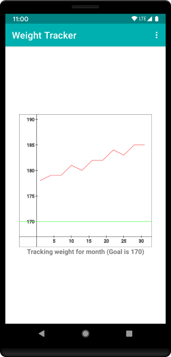

# `GraphLib-Kt`: An Open Source Android Library for Graphs

> _`GraphLib-Kt` is a small, easy-to-use, free (both free as in beer and free as in speech), open-source, Android library for graphing mathematical functions, plotting points, and drawing line graphs. Both the Kotlin source code and a ready-to-use jar file of the compiled classes are available for download._

## Motivation

Many Android applications can make effective use of graphs and data plots to help illustrate relationships, depict data trends, and track progress versus goals. `GraphLib-Kt` can support this type of functionality by providing an easy-to-use library for graphing functions, plotting data points, and drawing line graphs. For example, consider a weight-tracking application that plots progress against a goal weight. Figure 1 illustrates how such an application might look on an Android phone. The figure uses red data points and a line graph to show average monthly weights for the year, and it shows the goal weight as a green straight line near the bottom. Although the data values shown in the line graph are hypothetical, they are, unfortunately, realistic as they pertain to the developer of this project.

<figure>
  
  <figcaption>Figure 1. Tracking weight for a year.</figcaption>
</figure>

## Overview of the Library Design

`GraphLib-Kt` consists of ten classes, but most of the classes are relatively simple and easy to understand.  In fact, only one of the classes (`Graph.Builder`) requires any intellectual effort to master before using the library, and even that class is easy to understand if you have some familiarity with the Builder design pattern.  One important aspect of the library design is that the developer programs in terms of "world coordinates," not screen coordinates, and the library translates between the two.  Below I give brief descriptions of each of the ten classes followed by several examples showing how to use the library in an Android application.

Classes `Point`, `Circle`, and `Label` are shown in Listings 1-3.  Class `Point` encapsulates a pair of double values representing a point in the x,y-plane.  Class `Circle` encapsulates the x,y coordinates of the center of the circle plus the circle's radius.  Class `Label` encapsulates a double value and a string, where the double value represents a point on an axis and the string is used to label that point. The example shown in Figure 1 uses red data points for the weight values and labels for the x-axis showing one-letter abbreviations for the months.  Using these three classes in an application requires only knowledge of how to use Kotlin constructors.

#### Listing 1\. Class `Point`.
````kotlin
/**
 * Point encapsulates a pair of double values representing
 * a point in the x,y-plane using world coordinates.
 */
data class Point(val x: Double, val y: Double) {
    constructor(x: Int, y: Int): this(x.toDouble(), y.toDouble())
}
````

#### Listing 2\. Class `Circle`.
````kotlin
/**
 * Circle encapsulates a circle with center at (x, y) and specified radius.
 */
data class Circle(val x: Double, val y: Double, val radius: Double) {
    constructor(x: Int, y: Int, radius: Int):
            this(x.toDouble(), y.toDouble(), radius.toDouble())
}
````

#### Listing 3\. Class `Label`.
````kotlin
/**
 * Label encapsulates a double value and a string, where the double value
 * represents a point on an axis and the string is used to label that point.
 */
data class Label(val tick: Double, val label: String) {
    constructor(tick: Int, label: String): this(tick.toDouble(), label)
}
````

Classes `ScreenPoint`, `GraphPoints`, `GraphFunction` and `GraphCircle` are very simple and are used only internally with the library. Class `ScreenPoint` encapsulates a pair of integer values representing pixel coordinates on the screen of an Android device. This class is similar to but simpler than the Android class `Point` in package `android.graphics`.  Class `GraphPoints` encapsulates a list of screen points together with a color used to plot them.  This class is used internally for both plotting points and drawing line graphs.  Class `GraphFunction` encapsulates a function of type `(Double) -> Double` plus a color used to graph that function.  Similarly, class `GraphCircle` encapsulates a circle plus a color used to draw that circle.  Developers do not need to understand these four classes in order to use the library, and no further descriptions of the classes are provided. However, the source code for these classes is provided for anyone interested in the details.

Class `Graph` contains information about the colors, points, labels, graphs, etc., to be drawn, but it is essentially independent of Android graphics details. While `Graph` has a lot of properties, they all have default values, and therefore the Builder design pattern is used to create instances of this class. Class `Graph` contains a nested class named `Builder` that is used to create `Graph` objects. From a developer perspective, the two classes go together and should be understood essentially as one; but, in reality, it is important only that you understand how to use the nested class `Builder` to create a `Graph` object. Developers don't really do anything directly with a `Graph` object after it has been created other than pass it to a `GraphView` object, which does the work of displaying everything on an Android device. Listing 4 summarizes the methods available in class `Graph.Builder`. Several examples are provided below that illustrate how to use the Builder pattern to create `Graph` objects. For now, note simply that, other than method `build()` (last line in Listing 4), all other methods return the `Builder` object to allow for chaining of calls to builder methods.

#### Listing 4\. Summary of methods in class `Graph.Builder`.
````kotlin
fun addFunction(function: (Double) -> Double): Builder
fun addFunction(color: Int, function: (Double) -> Double): Builder
fun addPoints(points: List<Point>): Builder
fun addPoints(color: Int, points: List<Point>): Builder
fun addLineGraph(points: List<Point>): Builder
fun addLineGraph(color: Int, points: List<Point>): Builder
fun addCircle(circle: Circle): Builder
fun addCircle(color: Int, circle: Circle): Builder
fun setBackgroundColor(bgColor: Int): Builder
fun setAxesColor(axesColor: Int): Builder
fun setFunctionColor(functionColor: Int): Builder
fun setPointColor(pointColor: Int): Builder
fun setCircleColor(circleColor: Int): Builder
fun setWorldCoordinates(xMin: Double, xMax: Double, yMin: Double, yMax: Double): Builder
fun setWorldCoordinates(xMin: Int, xMax: Int, yMin: Int, yMax: Int): Builder
fun setAxes(x: Double, y: Double): Builder
fun setAxes(x: Int, y: Int): Builder
fun setXTicks(xTicks: List<Double>): Builder
fun setXTicks(vararg xTicks: Double): Builder
fun setXTicks(vararg xTicks: Int): Builder
fun setYTicks(yTicks: List<Double>): Builder
fun setYTicks(vararg yTicks: Double): Builder
fun setYTicks(vararg yTicks: Int): Builder
fun setXLabels(xLabels: List<Label>): Builder
fun setYLabels(yLabel: List<Label>): Builder
fun build(): Graph = Graph(this)
````

As shown in Listing 4, many of the methods are overloaded to make the library easier to use.  For example, the default color used to graph a function is black, but that can be changed using method `setFunctionColor()`.  You can add just a function to the `Graph`, and it will be graphed using the current default function color.  Alternatively, there is a single method that lets you add both a function and the color to be used to graph it.  Similarly, several methods are overloaded to accept parameters of type `Int` or type `Double`, with the `Int` values being converted to `Double` within the class.

Observe that some of the builder methods shown in Listing 4 start with the "`set`" prefix, and some start with the "`add`" prefix. Those starting with "`set`" control access to a single attribute value or collection of values, but those starting with "`add`" can be called multiple times to append to a list of similar attribute values.  So, for example, you "`set`" world coordinates, but you can "`add`" multiple functions.  In addition, you can set the "`tick`" marks on an axis, and they will be labeled with numerical values.  Alternatively, you "`set`" labels if you want the tick marks to be labeled with string values (see the x-axis in Figure 1).

A final comment on Listing 4 pertains to the two `setAxes()` methods, which, like several other methods, are overloaded to accept either `Int` or `Double` values.  Whenever you set the axes, the value for the first parameter `x` determines the placement of the y axis; i.e., a vertical line is drawn at that value for `x`.  Similarly, the value for the second parameter `y` determines the placement of the x axis; i.e., a horizontal line is drawn at that value for `y`.

> For additional details about the Builder Pattern, see [_Effective Java_ (Third Edition)](https://www.pearson.com/us/higher-education/program/Bloch-Effective-Java-3rd-Edition/PGM1763855.html) by Joshua Bloch or [_Effective Kotlin_](https://leanpub.com/effectivekotlin/) by Marcin Moskala.  The Kotlin Academy blog  [&ldquo;Effective Java in Kotlin, item 2: Consider a builder when faced with many constructor parameters&rdquo;](https://blog.kotlin-academy.com/effective-java-in-kotlin-item-2-consider-a-builder-when-faced-with-many-constructor-parameters-1927e69608e1) summarizes the Builder design pattern as explained by Marcin Moskala in his book.

User interface classes in Android are called views, and class `View` in package `android.view` is the basic building block for user interface components. A view occupies a rectangular region on the screen and is responsible for drawing and event handling within that region. From an inheritance perspective, class `View` is an ancestor class not only of user interface controls (buttons, text fields, etc.) but also of layouts, which are invisible view groups that are primarily responsible for arranging their child components. In this library, class `GraphView` extends `View` and is responsible for displaying the information encapsulated in a `Graph` on the screen of an Android device. In other words, class `GraphView` is where all the drawing takes place.  You don't need to understand the details of `GraphView`.  To use it, you simply add it to a layout for an activity or fragment as explained below.

## Using `GraphLib-Kt`

User interfaces for Android can be created in several ways, but a declarative approach using an XML layout file is usually easier, and that is the approach outlined here.

The basic steps for using the `GraphLib-Kt` library can be summarized as follows.

**Step 1\. Make `graphlib.jar` available to your Android project.**
Create a new project using Android Studio and create a "libs" subdirectory of the project's "app" directory.  Copy the jar file `graphlib.jar` to the newly created "libs" subdirectory. In Android Studio, switch the folder structure from Android to Project, and then, in the libs folder (nested within the app folder), right click on the jar file and then click on "Add as library." This last action will add the jar file in the dependencies section of your app's build.gradle file. See "[How to add a jar in External Libraries in android studio](https://stackoverflow.com/questions/25660166/how-to-add-a-jar-in-external-libraries-in-android-studio)" if you need extra help with this step.  As an alternative to using `graphlib.jar`, you can copy all of the Kotlin source files into your project, but using the jar file is probably easier.

**Step 2\. Create an Android activity or fragment that will use `GraphLib-Kt`.**
In Android applications, an activity represents a single screen with a user interface.  A fragment is essentially a subactivity that defines and manages its own layout, has its own lifecycle, and can handle its own input events. Fragments must be hosted by an activity or another fragment.  Activities and fragments are defined primarily in two files &ndash; an XML file that declares the UI layout and components, and a Java file that defines runtime functionality such as drawing and event handling. When a new project is created, Android Studio usually creates a default activity named `MainActivity`. Use this activity or create a new activity or fragment for your application.

**Step 3\. Add a `GraphView` to the layout for the activity.**
In the XML file for the activity's (or fragment's) layout, declare a `GraphView` object in much the same way that you declare a button or a text view except that you need to provide the full package name for the `GraphView`. Listing 5 shows an excerpt from a layout file that declares a `GraphView` followed by a `TextView` as part of a vertical linear layout. Following recommended practice, the actual values for the width and height of the `GraphView` are defined in a separate `dimens.xml` resource file. (Note: I used 325dp for both values in the examples below.)

#### Listing 5\. Declaring a `GraphView` and a `TextView` in a layout XML file.
````html
<com.softmoore.android.graphlib.GraphView
    android:id="@+id/graph_view"
    android:layout_width="@dimen/graphView_width"
    android:layout_height="@dimen/graphView_height" />

<TextView
    android:id="@+id/graph_view_label"
    android:layout_width="match_parent"
    android:layout_height="wrap_content"
    android:gravity="center_horizontal"
    android:textStyle="bold" />
````

**Step 4\. Import the library classes into the activity.**
Listing 6 shows the list of import statements for an application if the library classes are imported individually. The list of imports can be abbreviated to a single line by importing `com.softmoore.graphlib.*` if desired, but personally I prefer to see the expanded list as shown in Listing 6.  You should also import `android.graphics.Color` if you want to use any colors other than the default.

#### Listing 6\. Import the library classes.
````kotlin
import com.softmoore.graphlib.Graph
import com.softmoore.graphlib.GraphView
import com.softmoore.graphlib.Label
import com.softmoore.graphlib.Point
import com.softmoore.graphlib.Circle
````

**Step 5\. Build a `Graph` object and add it to the `GraphView`.**
Listing 7 shows the creation of the simplest possible graph object; i.e., a graph object that uses all of the default values. It essentially contains only an x-axis and a y-axis, with everthing drawn in the default color black.  The values on both axes range from -10 to 10, but only the even integer values are labeled. The listing also sets a title for the screen and text for the TextView below the graph. The result of running this application on an Android device is shown in Figure 2.  Note that the code in Listing 7 uses view binding instead of `findViewById()`, as explained in "[View binding](https://developer.android.com/topic/libraries/view-binding)".

> The essence of using this library is summarized in Step 5: Use `Graph.Builder` to build a `Graph` that gets displayed in a `GraphView` on an Android device.

#### Listing 7\. Build a `Graph` object and add it to the `GraphView`.
````kotlin
val graph = Graph.Builder()
    .build();

binding.graphView.setGraph(graph)
binding.graphViewLabel.text = getString(R.string.graphOfAxes)
title = getString(R.string.emptyGraph)
````
<figure>
  
  <figcaption>Figure 2. An empty graph &ndash; graph of axes only.</figcaption>
</figure>

## Additional `GraphLib-Kt` Examples

The remainder of this article will present several examples with brief descriptions and source code excerpts to illustrate the use of `GraphLib-Kt` features. Kotlin source code listings for these examples will focus only on using `Graph.Builder` to create the appropriate `Graph` object, as described in Step 5 above. Calls to methods `findViewById()` and `setGraph()`, and assignment to properties `title` and `textView.text.`, would be similar to those shown in Listing 7 and are not included in the remaining source code listings for these examples.

### Example 1: Graph of y = x<sup>2</sup> with color and adjusted world coordinates.

Let's start by adding the function y = x<sup>2</sup> to a graph, and let's draw the function using the color red. As shown in Listing 8, there is method `addFunction()` that has two parameters &ndash; both the function to be graphed and the color to be used for that graph.  Note the use of a lambda expression for the function.  Kotlin allows the lambda expression to be simplified as `{it*it}`, but a lamda expression explictly showing the parameter is used in this and all subsequent examples since it more closely resembles the mathematical notation for a function.

Also, since the function y = x<sup>2</sup> is predominantly above the x-axis, we will adjust the world coordinates (a.k.a. window) for the graph to show more of the function.  For this example we will let the x-axis range from -5 to 5 and the y-axis range from -2 to 20\. When we make this change, we also need to modify the "tick" marks on the axes using calls to methods `setXTicks()` and `setYTicks()`. Listing 8 shows the code to build this graph, and Figure 3 shows the resulting application running on an Android device.

#### Listing 8\. Graph of y = x<sup>2</sup> with color and adjusted world coordinates.
````kotlin
val graph = Graph.Builder()
    .addFunction(Color.RED) {x -> x*x}   // or simply {it*it}
    .setWorldCoordinates(-5, 5, -2, 20)
    .setXTicks(-4, -3, -2, -1, 1, 2, 3, 4)
    .setYTicks(2, 4, 6, 8, 10, 12, 14, 16, 18)
    .build()
````

<figure>
  
  <figcaption>Figure 3. Graph of y = x^2.</figcaption>
</figure>

### Example 2: Graphing three functions.

Listing 9 shows how to add three functions, each with different colors, and Figure 4 shows the application running on an Android device.  Listing 9 assumes that both `kotlin.math.sin` and `kotlin.math.PI` have been imported.

#### Listing 9\. Graphing three functions.
````kotlin
val graph = Graph.Builder()
    .addFunction(Color.RED, ::sin)
    .addFunction(Color.BLUE) {x -> 0.1*x*x*x}
    .addFunction(Color.GREEN) {x -> 1/x}
    .setWorldCoordinates(-2*PI, 2*PI, -5.0, 5.0)
    .setXTicks(-3, -1, 1, 3)
    .setYTicks(-3, -1, 1, 3)
    .build()
````

<figure>
  
  <figcaption>Figure 4. Graph of three functions.</figcaption>
</figure>

### Example 3: Line graph plus data points.

This example illustrates how to add a line graph plus data points.  Both line graphs and data points are defined by a set of points.  The difference is that we call `addLineGraph()` when using the points to define a line graph, and we call `addPoints()` when using the points define the data points.  This example uses the same set of points for both.  We call method `addPoints()` so that the data points themselves are highlighted as small circles.  Listing 10 shows how to add a line graph with data points, and Figure 5 shows the application running on an Android device.  The default color is set to  red, which is used for both the line graph and the data points.  Note that the last data point (12, 6) does not get displayed since it falls outside the (default) world coordinates.

#### Listing 10\. Line graph.
````kotlin
val points = listOf(Point(-10, 3), Point(-8, 4), Point(0, 0),
                    Point(2, -3),  Point(3,3),   Point(5, 2),
                    Point(7,5),    Point(9, 9),  Point(12, 6))

val graph = Graph.Builder()
    .setPointColor(Color.RED)
    .addLineGraph(points)
    .addPoints(points)
    .build()
````

<figure>
  
  <figcaption>Figure 5. Line graph with data points.</figcaption>
</figure>


### Example 4: Circles, polygons, and vertical lines.

Vertical lines and geometric shapes like circles and polygons (triangles, rectangles, etc.) cannot be expressed as mathematical functions.  But GraphLib-Kt provides a general capability for drawing line graphs, and line graphs can be used to draw vertical lines and polygons.  Technically a circle can be represented as two functions that define the top and bottom half of the circle; e.g., the unit circle can be defined using two lambda functions `{x -> sqrt(1 - x*x)}` and `{x -> -sqrt(1 - x*x)}`, but doing so is cumbersome, inefficient, and doesn't display as well as using the circle-drawing capability already available in Android.  Therefore the capability to draw circles was added to GraphLib-Kt.

Listing 11 show how to build a graph that draws a triangle, two circles, and a vertical blue line that is tangent to both circles on the left side.  Figure 6 shows the results on an Android device.

#### Listing 11\. Triangle, two circles, and a vertical tangent line.
````kotlin
val verticalLine = listOf(Point(-1, -2),  Point(-1, 2))
val triangle = listOf(Point(0.0, 0.5), Point(1.0, 0.5), Point(1.0, 1.0), Point(0.0, 0.5))

val graph = Graph.Builder()
    .setWorldCoordinates(-2, 2, -2, 2)
    .setXTicks(-1.5, -0.5, 0.5, 1.5)
    .setYTicks(-1.5, -0.5, 0.5, 1.5)
    .setCircleColor(Color.MAGENTA)
    .addCircle(Circle(0, 0, 1))   // uses default circle color magenta
    .addCircle(Color.RED, Circle(0.5, 0.0, 1.5))
    .addLineGraph(Color.BLUE, verticalLine)
    .addLineGraph(triangle)   // uses default triangle color black
    .build()
````

<figure>
  
  <figcaption>Figure 6. Triangle, two circles, and a vertical tangent line.</figcaption>
</figure>

### Example 5: Tracking weight for one month.

For this example let's assume that we have a weight-tracking application that shows weights measured for several days throughout a given month. The example is similar to the original example introduced at the beginning of this article and depicted in Figure 1 in that it uses a horizontal _goal weight_ line and it shows actual weight measurements. But the example shown in Figure 1 used string labels on the horizontal axis, and this example will use numbers representing the days of the month that the weights were recorded. Listing 12 shows the code to add both a horizontal green line for the goal weight and a line graph for the measured weights.  Figure 7 shows the application running on an Android device.

#### Listing 12\. Tracking weight for one month.
````kotlin
// points show weights for every third day of the month
val points = listOf(Point(1, 178),  Point(4, 179),  Point(7, 179),
                    Point(10, 181), Point(13, 180), Point(16, 182),
                    Point(19, 182), Point(22, 184), Point(25, 183),
                    Point(28, 185), Point(31, 185))

val graph = Graph.Builder()
    .setWorldCoordinates(-5, 33, 165, 191)
    .setAxes(0, 167)
    .setXTicks(5, 10, 15, 20, 25, 30)
    .setYTicks(170, 175, 180, 185, 190)
    .addFunction(Color.GREEN) {170.0}
    .addLineGraph(Color.RED, points)
    .build()
````

<figure>
  
  <figcaption>Figure 7. Tracking weight for one month.</figcaption>
</figure>

### Example 6: Tracking weight for a year.

We now come full circle back to the motivating example depicted in Figure 1 at the beginning of this report showing weight measurements for an entire year. Similar to example 5 above, this application uses a horizontal _goal weight_ line, but it shows a plot of the individual data points (average weights) for each month, and it uses a straight line to show the yearly trend. One new feature shown in this example is the addition of nonnumeric (string) labels for the x-axis. All previous examples have used methods `setXTicks()` and `setYTicks()` to specify the placement of numeric labels for the axes. This example uses `setXLabels()` for the month abbreviations on the x-axis, but it still uses `setYTicks()` to show the numerical values for weights on the y-axis. Due to space limitation on most Android phone screens, the months are abbreviated using only the first letter of the month name. Listing 13 shows the source code to build the graph. For convenience of the reader, Figure 8 simply repeats Figure 1 showing the application running on an Android device.

> When a set of points visually appear to be in a pattern that is "almost" a straight line, it is possible use a technique known as linear regression to determine the line that best fits the data points. A detailed discussion of linear regression is beyond the scope of this report, but that was the approach used to find the formula for the red line used in this example.

#### Listing 13\. Tracking weight for a year.
````kotlin
// points show average weight for each month
val points = listOf(Point(1, 178),  Point(2, 179),  Point(3, 179),
                    Point(4, 181),  Point(5, 180),  Point(6, 182),
                    Point(7, 182),  Point(8, 184),  Point(9, 183),
                    Point(10, 185), Point(11, 185), Point(12, 186))

// labels for months
val xLabels = listOf(Label(1, "J"),  Label(2, "F"),  Label(3, "M"),
                     Label(4, "A"),  Label(5, "M"),  Label(6, "J"),
                     Label(7, "J"),  Label(8, "A"),  Label(9, "S"),
                     Label(10, "O"), Label(11, "N"), Label(12, "D"))

val graph = Graph.Builder()
    .setWorldCoordinates(-2, 13, 165, 191)
    .setAxes(0, 167)
    .setXLabels(xLabels)
    .setYTicks(170, 175, 180, 185, 190)
    .addFunction(Color.RED) {x -> 0.72*x + 177.32}
    .addFunction(Color.GREEN) {170.0}
    .addPoints(Color.RED, points)
    .build()
````

<figure>
  
  <figcaption>Figure 8. Tracking weight for a year.</figcaption>
</figure>

## Conclusion

Many Android applications can make effective use of graphs and data plots to illustrate relationships, depict data trends, and track progress versus goals. `GraphLib-Kt` can support this type of functionality by providing an easy-to-use library for graphing functions, plotting data points, and drawing line graphs.
